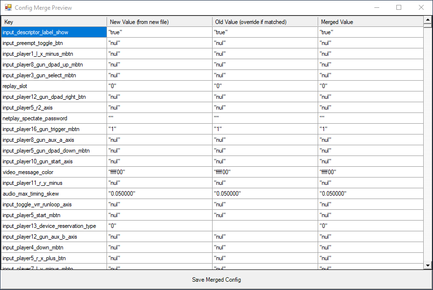

# Sync-Config.ps1

A PowerShell utility to intelligently **sync configuration files** line-by-line, preserving your existing values while adopting newer structure or parameters from an updated config.

### ⚙️ What It Does

This tool helps you when an application (e.g. RetroArch) updates its config file format or adds new parameters, and you want to:

- **Retain your current settings** from an older config.
- **Adopt all new parameters** from the updated config.
- **Avoid copying over deprecated or obsolete values.**
- **Preview the changes** before applying them.
- **See differences with color-coded highlighting** in a simple GUI.

---

### 📌 Screenshot



---

### 📌 Features

- Select new and old config files interactively
- Parses `key = value` lines from both files
- **Overrides values in the new file** with matching values from the old file
- **Keeps all new settings** from the updated config
- **Preserves** comments and formatting of the new file
- **GUI preview** of merged results with color codes:
  - Yellow rows indicate differences
- Save merged config as `merged_config.cfg`

---

### 💻 Requirements

- Windows
- PowerShell 5.1 or later
- No external dependencies

---

### 📦 Installation

Just download or clone the script:

```bash
git clone https://github.com/yourusername/sync-config-ps1.git
cd sync-config-ps1
